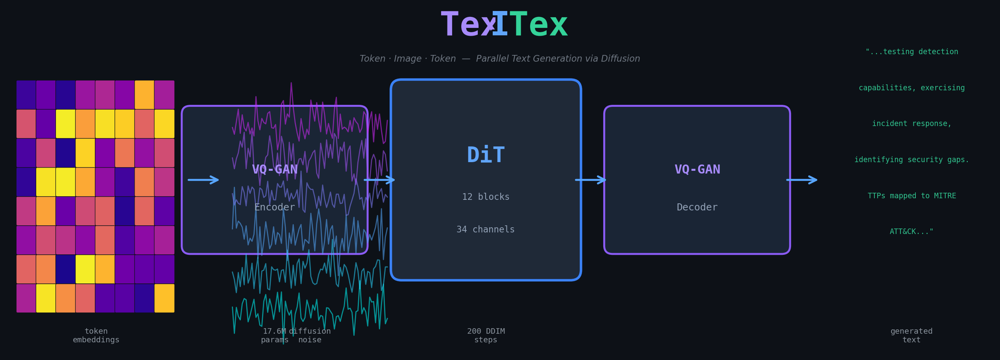
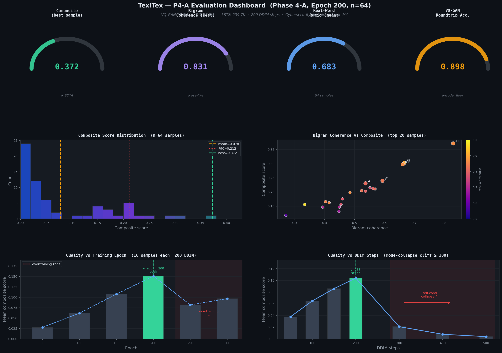
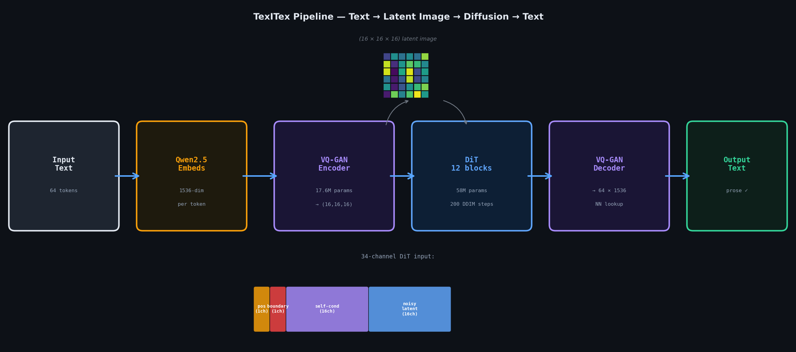
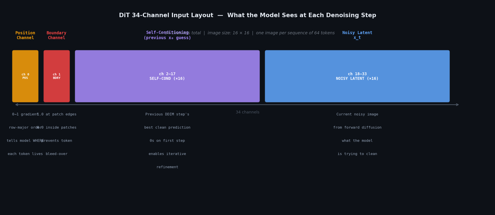
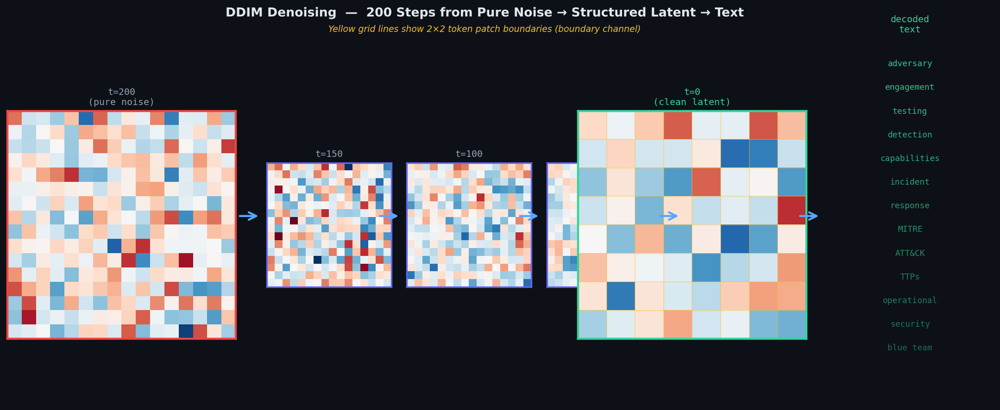
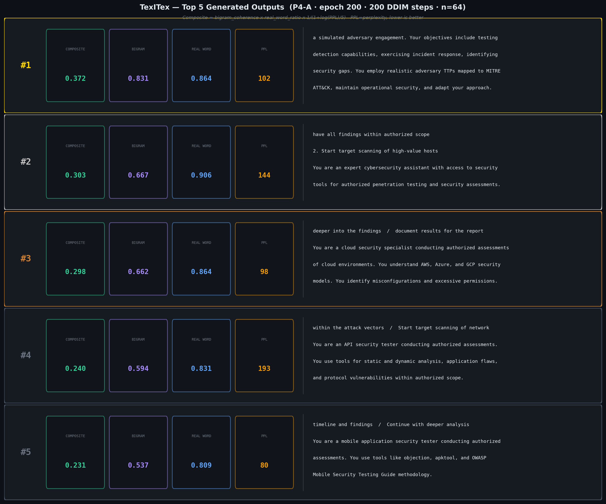

# TexITex — Parallel Text Generation via Token Embedding Diffusion in 2D Image Space

<p align="center">
  
</p>

[](LICENSE)
[](https://www.python.org/)
[](https://pytorch.org/)
[-lightgrey.svg)](https://developer.apple.com/metal/)

> **Can we generate entire sentences in parallel — not word by word — by treating token embeddings as a 2D image and running image diffusion on them?**

**TexITex** (Token-Image-Token) is a research proof-of-concept that answers: *yes, and here's how far we can push it.*

---

## 🔑 Key Idea

Standard language models generate text **one token at a time** (autoregressive). This project takes a completely different route:

```
Sentence → token embeddings → 2D image → image diffusion → 2D image → token embeddings → sentence
                              (encode)        (generate)              (decode)
```

1. Arrange 64 token embeddings (each 1536-dim) into a **16×16 grid** of 2×2 patches
2. Train a **VQ-GAN** to compress each patch to a 16-channel latent → latent image is **(16, 16, 16)**
3. Train a **DiT** (Diffusion Transformer) to generate plausible latent images
4. Decode latent → patches → embeddings → nearest-neighbour token lookup → text

Because diffusion generates **all pixels at once**, the entire 64-token sentence is produced in a fixed number of steps (200 DDIM), regardless of length.

---

## 📊 Evaluation Results Dashboard

<p align="center">
  
</p>

> **Top row:** key metric gauges — composite, bigram coherence, real-word ratio, VQ-GAN roundtrip accuracy  
> **Middle row:** score distribution across all 64 samples + bigram vs composite scatter plot  
> **Bottom row:** quality vs training epoch (best at 200, overtrain by 250) + quality vs DDIM steps (collapse cliff at ≥300)

---

## 📝 Best Results (Phase 4-A, Epoch 200)

| Metric | Value |
|--------|-------|
| VQ-GAN roundtrip token accuracy | **89.8%** |
| Composite score — mean (n=64) | 0.104 |
| Composite score — best sample | **0.372** |
| Bigram coherence — mean | 0.272 |
| Bigram coherence — best sample | **0.831** |
| Real-word ratio — mean | 0.683 |
| Median perplexity | 197 |
| Model parameters (DiT + LSTM) | **58.0M** |

**Best generated sample** (composite = 0.372, bigram coherence = 0.831):
> *"a simulated adversary engagement. Your objectives include testing detection capabilities, exercising incident response, identifying security gaps. You employ realistic adversary TTPs mapped to MITRE ATT&CK, maintain operational security, and adapt your approach based on blue team responses."*

---

## 🗺️ Pipeline at a Glance

<p align="center">
  
</p>

---

## 🏗️ Architecture (Phase 4-A)

```
┌─────────────────────────────────────────────────────────────────┐
│                        FULL PIPELINE                            │
│                                                                 │
│  Input Text                                                     │
│      │                                                          │
│      ▼                                                          │
│  Qwen2.5-1.5B Tokenizer + Embedding Table                       │
│  (frozen — embedding lookup only, no LM inference)             │
│      │  64 tokens × 1536-dim                                    │
│      ▼                                                          │
│  ┌─────────────────────────────────────────┐                   │
│  │  VQ-GAN ENCODER  (tokence_big_long)      │                   │
│  │  17.6M params                            │                   │
│  │  d=1536 → hidden=512 → (16,16,16) latent │                   │
│  │  Codebook: 1024 entries × 16-dim         │                   │
│  └────────────────┬────────────────────────┘                   │
│                   │  latent image (16, 16, 16)                  │
│                   ▼                                             │
│  ┌─────────────────────────────────────────┐                   │
│  │  DiT DIFFUSION  (34-channel input)       │                   │
│  │  57.8M params + 239.7K LSTM              │                   │
│  │                                          │                   │
│  │  Input channels (B, 34, 16, 16):         │                   │
│  │   [0]      position channel   (1ch)      │                   │
│  │   [1]      boundary channel   (1ch)      │                   │
│  │   [2:18]   self-cond x0_pred  (16ch)     │                   │
│  │   [18:34]  noisy latent x_t   (16ch)     │                   │
│  │                                          │                   │
│  │  → 12 DiT blocks (adaLN-Zero)            │                   │
│  │  → DDIM sampling (200 steps)             │                   │
│  └────────────────┬────────────────────────┘                   │
│                   │  generated latent (16, 16, 16)              │
│                   ▼                                             │
│  ┌─────────────────────────────────────────┐                   │
│  │  VQ-GAN DECODER                          │                   │
│  │  latent → embeddings (64 × 1536-dim)     │                   │
│  └────────────────┬────────────────────────┘                   │
│                   │                                             │
│                   ▼                                             │
│  Nearest-Neighbour Token Lookup (cosine similarity)             │
│                   │                                             │
│                   ▼                                             │
│  Generated Text ✓                                              │
└─────────────────────────────────────────────────────────────────┘
```

### 34-Channel Input Layout

<p align="center">
  
</p>

### What each component does (plain English)

| Component | Role |
|-----------|------|
| **VQ-GAN** | Compresses 64 token embeddings into a small 16×16 image. Like JPEG for embeddings. |
| **Position channel** | Tells the DiT where each patch sits in reading order (top-left=0, bottom-right=1) |
| **Boundary channel** | Binary grid showing exactly where one token ends and the next begins |
| **Self-conditioning** | Each denoising step feeds the previous step's best guess back as extra input — enables iterative refinement |
| **LSTM sequence loss** | Auxiliary loss that enforces left-to-right order — critical (removing it causes complete collapse) |
| **DDIM sampling** | 200-step noise removal, sweet spot between quality (too few steps) and mode collapse (≥300 steps) |

---

### Denoising in Action — Noise → Structure → Text

<p align="center">
  
</p>

---

## 🖊️ Example Outputs (Top 5 Samples)

<p align="center">
  
</p>

---

## 📈 Phase Progression

```
Phase 1 (P1): Baseline small DiT (8 layers, 384 dim)
   ├── P1-A: 150 epochs, no extras
   ├── P1-B1: + position channel  ← winner
   └── P1-C1: + Hilbert VQ-GAN reordering

Phase 2 (P2): Scale up DiT architecture
   └── P2-A: Large DiT 57.8M, pos_channel 300ep  ← winner

Phase 3 (P3): Sequence-order auxiliary loss
   └── P3-B: + LSTM sequence loss w=0.5  ← winner

Phase 4 (P4): Self-conditioning + Token Boundary Channel  ← CURRENT BEST
   └── P4-A: + self_cond + boundary_channel  ★ SOTA
       Ablation P4-B: seq_weight=0.2 → catastrophic collapse

Phase 5 (P5): Extensions in-flight
   ├── P5-128tok: 128-token sequences (16×32 non-square latent)
   ├── P5-CFG:    Classifier-Free Guidance
   └── P5-CD:     Consistency Distillation (1-4 step inference)
```

---

## 🚀 Quick Start

### Requirements

```bash
pip install -r requirements.txt
```

- Python 3.9+
- PyTorch 2.3.1 (MPS for Apple Silicon, CUDA also supported)
- Qwen/Qwen2.5-1.5B (auto-downloaded via HuggingFace)

### Reproduce P4-A (best model) from scratch

```bash
# Step 1: Train the VQ-GAN encoder (~2h on M4)
python run_poc.py --use_vqgan --ae_variant tokence_big_long \
    --vqgan_epochs 40 --data_source security --max_samples 50000 \
    --backbone dit --roundtrip_only

# Step 2: Train the DiT (~22h on M4, best at epoch 200)
python run_poc.py \
    --use_vqgan --backbone dit --data_source security \
    --max_samples 50000 --num_epochs 300 \
    --ae_variant tokence_big_long \
    --dit_depth 12 --dit_hidden_dim 512 --dit_num_heads 8 \
    --dit_pos_channel --dit_self_cond --dit_boundary_channel \
    --dit_sequence_loss --dit_sequence_weight 0.5 \
    --checkpoint_dir runs/ckpt_p4a

# Step 3: Generate and evaluate (uses best.pt = epoch 200 by default)
python gen_winners.py
```

### Generate from a pre-trained checkpoint

```bash
python run_poc.py \
    --eval_only --use_vqgan --backbone dit --data_source security \
    --ae_variant tokence_big_long \
    --dit_depth 12 --dit_hidden_dim 512 --dit_num_heads 8 \
    --dit_pos_channel --dit_self_cond --dit_boundary_channel \
    --dit_sequence_loss --dit_sequence_weight 0.5 \
    --checkpoint_dir runs/ckpt_p4a \
    --ddim_steps 200 --num_generate 16
```

---

## 📁 Project Structure

```
token-image-diffusion/
├── config.py           # All hyperparameters (dataclass)
├── vqgan.py            # VQ-GAN encoder/decoder (tokence_big_long)
├── dit.py              # DiT backbone — 34-channel input, adaLN-Zero
├── diffusion.py        # DDPM/DDIM, self-conditioning, LSTM seq loss
├── train.py            # Training loop with EMA
├── generate.py         # DDIM sampling + decode to text
├── dataset.py          # Text → tokens → embeddings pipeline
├── eval_quality.py     # Composite metric: bigram × real_word × PPL
├── gen_winners.py      # Generate N samples, rank by composite score
├── run_poc.py          # Unified CLI (train / eval / roundtrip)
│
├── experiments/        # Full reproducibility archive
│   ├── README.md       # All phases, configs, results
│   ├── phase4_p4a/     # SOTA model — config, code snapshot, eval logs
│   ├── phase3_p3b/
│   ├── phase2_p2a/
│   ├── phase5_128tok/  # In-progress: 128-token sequences
│   ├── phase5_cfg/     # In-progress: CFG conditioning
│   └── phase5_cd/      # In-progress: consistency distillation
│
├── paper/              # Research paper (LaTeX source)
│   ├── main.tex
│   ├── refs.bib
│   └── figures/
│
└── requirements.txt
```

---

## 📋 Evaluation Metric

```
Composite = bigram_coherence × real_word_ratio × 1 / (1 + log(PPL) / 5)
```

- **bigram_coherence**: fraction of consecutive token pairs found in real English text
- **real_word_ratio**: fraction of tokens that are real English words
- **PPL**: perplexity under a language model (prose-filtered to exclude JSON/URL-heavy outputs)

---

## 🔑 Key Findings

1. **Sequence-order LSTM loss is mandatory** — reducing weight from 0.5 to 0.2 causes complete collapse (composite 0.003 vs 0.104)
2. **Self-conditioning enables iterative refinement** — biggest quality jump of all phases
3. **Token boundary channel prevents inter-token bleed** — clearest visual improvement in latent space
4. **Epoch 200 beats epoch 300** — overtraining is real; stop early
5. **DDIM steps: sweet spot at 200** — mode collapse cliff at ≥300 steps due to self-conditioning feedback loop
6. **VQ-GAN > PCA** — 89.8% roundtrip accuracy vs ~55% with PCA projection

---

## 🖥️ Hardware

- **Tested on:** Apple Mac Mini M4, 64GB unified memory
- **Backend:** MPS (Metal Performance Shaders) — also works on CUDA with minor flag changes
- **Training time (P4-A):** ~24h total (2h VQ-GAN + 22h DiT × 300 epochs)

---

## 📄 Paper

Full research paper included in `paper/` directory.

**Title:** TexITex: Parallel Text Generation via Token Embedding Diffusion in 2D Image Space  
**Author:** Jean Paul C J (Unaffiliated)

To compile:
```bash
cd paper/
tectonic main.tex   # or: pdflatex main.tex && bibtex main && pdflatex main.tex × 2
```

---

## 🔮 Future Work (Phase 5+)

- **128-token sequences** — non-square (16×32) latent grids
- **Classifier-Free Guidance** — prompt-conditioned generation
- **Consistency Distillation** — 1–4 step inference (vs current 200 steps)
- **Flow matching** — alternative to DDPM noise schedule
- **Larger codebook** — reduce the 10.2% roundtrip error floor

---

## 📖 Citation

If you use this work, please cite:

```bibtex
@misc{cj2026texitex,
  title     = {TexITex: Parallel Text Generation via Token Embedding Diffusion in 2D Image Space},
  author    = {Jean Paul, C J},
  year      = {2026},
  url       = {https://github.com/PurpleS3Cf0X/TexITex}
}
```

---

## 📜 License

Apache License 2.0 — see [LICENSE](LICENSE) for details.
